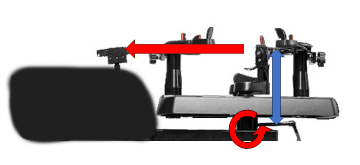
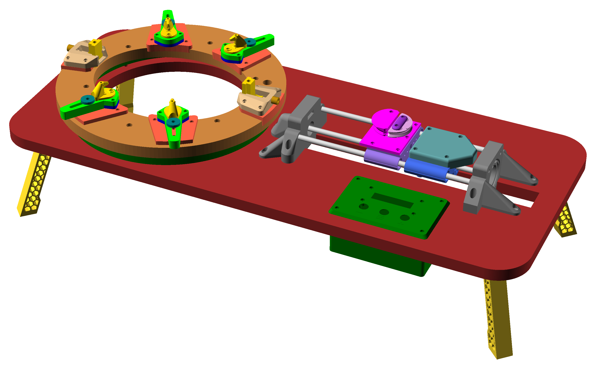
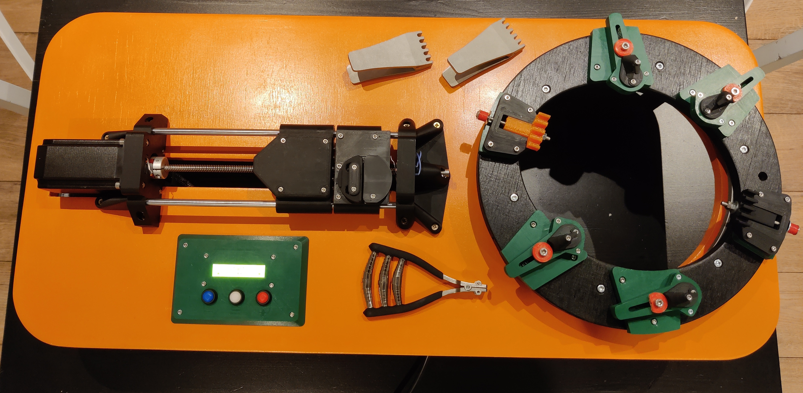

  

# KhordUino (3D Printed Electronic Badminton Stringer)

Welcome to the KhordUino project, a 3D Printed Electronic Badminton Stringer. 

## Mechanical design

A stringing machine usually comprises a stable frame, clamps to hold strings in place and a tensioning system to tighten strings. 
Electronic models have control panels for precision. 

The KhordUino design is quite different from most metal frame stringing machines. In these machines (see below), the rotating joint for the frame is quite far from the tensioning plane.

  

In order to not require many metal components the rotating element (holding the racket) and the part pulling 
on the strings should be aligned as much as possible to minimise the moment (blue arrow).
This is achieved by keeping the machine quite flat (which is also great for storage).

  

  

The rotation joint is kept very close to the racket face. This can only be achieved by using a large bearing "around" the racket rather than underneath it.
As the rotating joint and the tensioning part of the machine are almost in the same plane the resulting Moment is greatly reduced.

## BOM

[KhordUino Bill of Material (spreadsheet)](https://docs.google.com/spreadsheets/d/1VggcFAZ6FdfzaC9WXAd_AR7_Q7eQJJpP21XG0TGiltw/edit?usp=sharing)

## Documentation

The [Assembly Manual](MPEBS_Manual.pdf) provides a step-by-step guide to print and assemble your own KhordUino.

## License

KhordUino © 2023 by Antoine Colin is licensed under CC BY-NC-SA 4.0

